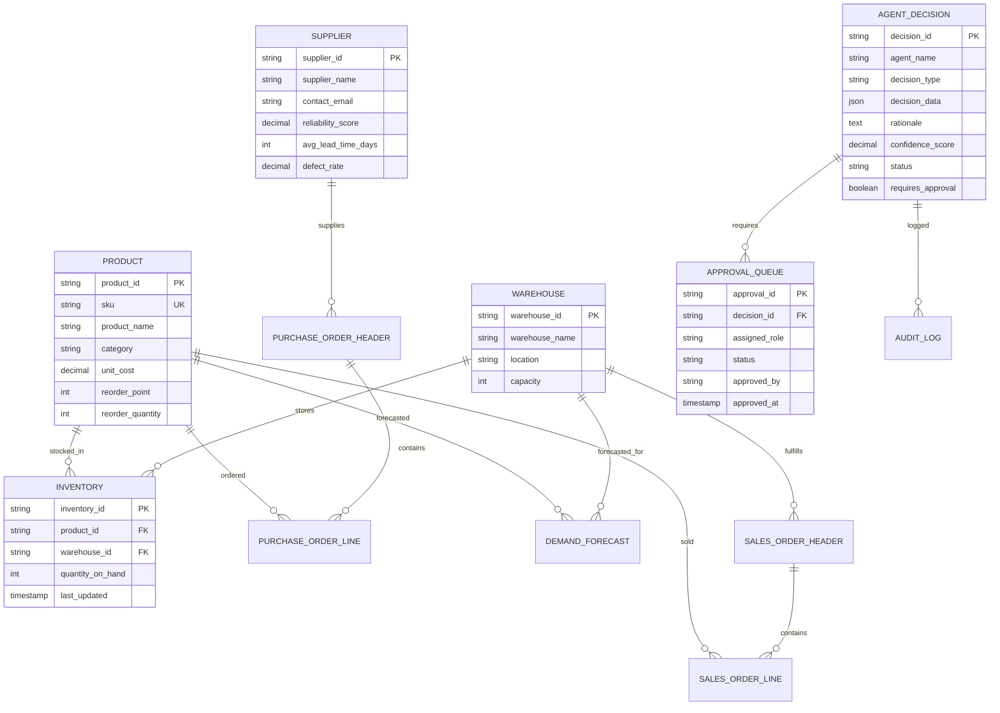

# Design Document: Supply Chain AI Platform

## Overview

This document describes the technical design for an MVP autonomous AI-powered supply chain optimization platform. The system employs an agentic AI architecture where autonomous agents (Procurement, Inventory Rebalancing, and Forecasting) make decisions with human oversight for high-risk actions.

### Architecture Philosophy

The platform follows a serverless, event-driven **Generative AI + Agentic AI** architecture on AWS, leveraging:
- **AWS Bedrock** for foundation models (Claude 3.5 Sonnet) powering intelligent agents
- **Bedrock Agents** for autonomous decision-making with tool integration
- **Lambda functions** for agent tools and custom business logic (stateless, scalable)
- **Redshift Serverless** as the single source of truth for all operational data
- **S3** for data staging, synthetic data storage, and agent artifacts
- **Glue** for ETL pipelines
- **SageMaker** for hosting the Streamlit UI
- **EventBridge** for scheduled agent triggers
- **IAM** for access control

### Key Design Principles

1. **Gen AI First**: Use AWS Bedrock foundation models (Claude 3.5 Sonnet) for natural language reasoning, decision-making, and explanation generation
2. **Agentic AI Architecture**: Autonomous agents with tool-calling capabilities, memory, and reasoning chains
3. **Explainability First**: Every agent decision includes natural language rationale and confidence scores generated by LLMs
4. **Human-in-the-Loop**: High-risk decisions route to approval queues with AI-generated explanations
5. **Audit Everything**: Immutable audit log in Redshift Serverless for compliance
6. **Serverless Simplicity**: No infrastructure management, console-based operations
7. **Single Region**: All resources in us-east-1 (N. Virginia) for optimal Bedrock availability

## Architecture


### System Architecture Diagram

```mermaid
graph TB
    subgraph "User Interface Layer"
        UI[Streamlit Dashboard on SageMaker]
    end
    
    subgraph "Gen AI Layer - AWS Bedrock"
        BEDROCK[Bedrock Runtime API<br/>Claude 3.5 Sonnet]
        BA_PROC[Bedrock Agent: Procurement]
        BA_INV[Bedrock Agent: Inventory]
        BA_FORE[Bedrock Agent: Forecasting]
    end
    
    subgraph "Agent Tools - Lambda Functions"
        TOOL_INV[Inventory Query Tool]
        TOOL_FORE[Forecast Query Tool]
        TOOL_SUP[Supplier Selection Tool]
        TOOL_PO[Create PO Tool]
        TOOL_TRANS[Transfer Inventory Tool]
        TOOL_CALC[Calculate Metrics Tool]
    end
    
    subgraph "Orchestration"
        EB[EventBridge Scheduler]
        HAQ[Human Approval Queue]
    end
    
    subgraph "Data Layer"
        RS[(Redshift Serverless)]
        S3[S3 Buckets]
        GLUE[Glue ETL Jobs]
    end
    
    subgraph "Security & Monitoring"
        IAM[IAM Roles & Policies]
        CW[CloudWatch Logs]
    end
    
    UI -->|Query Data| RS
    UI -->|Approve/Reject| HAQ
    UI -->|Invoke Agent| BA_PROC
    UI -->|Invoke Agent| BA_INV
    
    EB -->|Trigger Daily| BA_PROC
    EB -->|Trigger Daily| BA_INV
    EB -->|Trigger Daily| BA_FORE
    
    BA_PROC -->|LLM Reasoning| BEDROCK
    BA_INV -->|LLM Reasoning| BEDROCK
    BA_FORE -->|LLM Reasoning| BEDROCK
    
    BA_PROC -->|Call Tool| TOOL_INV
    BA_PROC -->|Call Tool| TOOL_SUP
    BA_PROC -->|Call Tool| TOOL_PO
    
    BA_INV -->|Call Tool| TOOL_INV
    BA_INV -->|Call Tool| TOOL_FORE
    BA_INV -->|Call Tool| TOOL_TRANS
    
    BA_FORE -->|Call Tool| TOOL_CALC
    
    TOOL_INV -->|Read/Write| RS
    TOOL_FORE -->|Read/Write| RS
    TOOL_SUP -->|Read| RS
    TOOL_PO -->|Write| RS
    TOOL_TRANS -->|Write| RS
    TOOL_CALC -->|Read/Write| RS
    
    BA_PROC -->|High Risk| HAQ
    BA_INV -->|High Risk| HAQ
    
    HAQ -->|Store| RS
    
    GLUE -->|Extract| S3
    GLUE -->|Load| RS
    
    BEDROCK -.->|Logs| CW
    BA_PROC -.->|Logs| CW
    BA_INV -.->|Logs| CW
    BA_FORE -.->|Logs| CW
    TOOL_INV -.->|Logs| CW
    TOOL_PO -.->|Logs| CW
    GLUE -.->|Logs| CW
    
    IAM -->|Authorize| BEDROCK
    IAM -->|Authorize| BA_PROC
    IAM -->|Authorize| BA_INV
    IAM -->|Authorize| BA_FORE
    IAM -->|Authorize| UI
    IAM -->|Authorize| GLUE
```



### Data Flow

1. **Data Ingestion**: Synthetic data files uploaded to S3 → Glue ETL jobs transform and load into Redshift Serverless
2. **Agent Execution**: EventBridge triggers Bedrock Agents daily → Agents use Claude 3.5 Sonnet for reasoning → Agents call Lambda tools to query Redshift Serverless → LLM generates decisions with natural language rationale
3. **Decision Routing**: Low-risk decisions execute automatically via tool calls → High-risk decisions route to approval queue in Redshift Serverless with AI-generated explanations
4. **Human Review**: Users view pending approvals in Streamlit → Approve/reject via UI → Bedrock Agent executes approved actions via tool calls
5. **Audit Trail**: All decisions, approvals, and data changes logged to Redshift Serverless audit_log table with LLM-generated explanations


## Components and Interfaces

### 1. Redshift Serverless Data Warehouse

**Purpose**: Central data repository for all operational data, agent decisions, and audit logs using serverless architecture.

**Configuration**:
- **Deployment**: Redshift Serverless workgroup in us-east-1
- **Base Capacity**: 32 RPUs (Redshift Processing Units) for MVP
- **Scaling**: Auto-scales based on workload
- **Region**: us-east-1 (N. Virginia) for optimal Bedrock integration
- **Namespace**: supply-chain-platform
- **Workgroup**: supply-chain-workgroup

**Schema Design**:

```sql
-- Core operational tables
CREATE TABLE product (
    product_id VARCHAR(50) PRIMARY KEY,
    sku VARCHAR(50) UNIQUE NOT NULL,
    product_name VARCHAR(200),
    category VARCHAR(100),
    unit_cost DECIMAL(10,2),
    reorder_point INTEGER,
    reorder_quantity INTEGER,
    created_at TIMESTAMP DEFAULT CURRENT_TIMESTAMP
);

CREATE TABLE warehouse (
    warehouse_id VARCHAR(50) PRIMARY KEY,
    warehouse_name VARCHAR(100) NOT NULL,
    location VARCHAR(100),
    capacity INTEGER,
    created_at TIMESTAMP DEFAULT CURRENT_TIMESTAMP
);

CREATE TABLE supplier (
    supplier_id VARCHAR(50) PRIMARY KEY,
    supplier_name VARCHAR(200) NOT NULL,
    contact_email VARCHAR(100),
    reliability_score DECIMAL(3,2),
    avg_lead_time_days INTEGER,
    defect_rate DECIMAL(5,4),
    created_at TIMESTAMP DEFAULT CURRENT_TIMESTAMP
);

CREATE TABLE inventory (
    inventory_id VARCHAR(50) PRIMARY KEY,
    product_id VARCHAR(50) REFERENCES product(product_id),
    warehouse_id VARCHAR(50) REFERENCES warehouse(warehouse_id),
    quantity_on_hand INTEGER,
    last_updated TIMESTAMP DEFAULT CURRENT_TIMESTAMP
);

CREATE TABLE purchase_order_header (
    po_id VARCHAR(50) PRIMARY KEY,
    supplier_id VARCHAR(50) REFERENCES supplier(supplier_id),
    order_date DATE,
    expected_delivery_date DATE,
    total_amount DECIMAL(12,2),
    status VARCHAR(50),
    created_by VARCHAR(100),
    approved_by VARCHAR(100),
    approved_at TIMESTAMP,
    created_at TIMESTAMP DEFAULT CURRENT_TIMESTAMP
);

CREATE TABLE purchase_order_line (
    po_line_id VARCHAR(50) PRIMARY KEY,
    po_id VARCHAR(50) REFERENCES purchase_order_header(po_id),
    product_id VARCHAR(50) REFERENCES product(product_id),
    quantity INTEGER,
    unit_price DECIMAL(10,2),
    line_total DECIMAL(12,2),
    created_at TIMESTAMP DEFAULT CURRENT_TIMESTAMP
);

CREATE TABLE sales_order_header (
    so_id VARCHAR(50) PRIMARY KEY,
    order_date DATE,
    warehouse_id VARCHAR(50) REFERENCES warehouse(warehouse_id),
    status VARCHAR(50),
    created_at TIMESTAMP DEFAULT CURRENT_TIMESTAMP
);

CREATE TABLE sales_order_line (
    so_line_id VARCHAR(50) PRIMARY KEY,
    so_id VARCHAR(50) REFERENCES sales_order_header(so_id),
    product_id VARCHAR(50) REFERENCES product(product_id),
    quantity INTEGER,
    created_at TIMESTAMP DEFAULT CURRENT_TIMESTAMP
);

-- Agent decision and audit tables
CREATE TABLE agent_decision (
    decision_id VARCHAR(50) PRIMARY KEY,
    agent_name VARCHAR(100) NOT NULL,
    decision_type VARCHAR(100) NOT NULL,
    decision_data JSON,
    rationale TEXT,
    confidence_score DECIMAL(3,2),
    status VARCHAR(50),
    requires_approval BOOLEAN,
    created_at TIMESTAMP DEFAULT CURRENT_TIMESTAMP
);

CREATE TABLE approval_queue (
    approval_id VARCHAR(50) PRIMARY KEY,
    decision_id VARCHAR(50) REFERENCES agent_decision(decision_id),
    assigned_role VARCHAR(100),
    status VARCHAR(50),
    approved_by VARCHAR(100),
    approved_at TIMESTAMP,
    rejection_reason TEXT,
    created_at TIMESTAMP DEFAULT CURRENT_TIMESTAMP
);

CREATE TABLE audit_log (
    event_id VARCHAR(50) PRIMARY KEY,
    timestamp TIMESTAMP DEFAULT CURRENT_TIMESTAMP,
    agent_name VARCHAR(100),
    user_name VARCHAR(100),
    action_type VARCHAR(100),
    entity_type VARCHAR(100),
    entity_id VARCHAR(50),
    rationale TEXT,
    confidence_score DECIMAL(3,2),
    before_state JSON,
    after_state JSON,
    metadata JSON
);

-- Forecasting tables
CREATE TABLE demand_forecast (
    forecast_id VARCHAR(50) PRIMARY KEY,
    product_id VARCHAR(50) REFERENCES product(product_id),
    warehouse_id VARCHAR(50) REFERENCES warehouse(warehouse_id),
    forecast_date DATE,
    forecast_horizon_days INTEGER,
    predicted_demand INTEGER,
    confidence_interval_lower INTEGER,
    confidence_interval_upper INTEGER,
    confidence_level DECIMAL(3,2),
    created_at TIMESTAMP DEFAULT CURRENT_TIMESTAMP
);

CREATE TABLE forecast_accuracy (
    accuracy_id VARCHAR(50) PRIMARY KEY,
    product_id VARCHAR(50) REFERENCES product(product_id),
    forecast_date DATE,
    actual_demand INTEGER,
    predicted_demand INTEGER,
    mape DECIMAL(5,2),
    created_at TIMESTAMP DEFAULT CURRENT_TIMESTAMP
);
```

**Connection Pattern**:
- Lambda functions use `redshift-data` API for serverless connectivity (no connection pooling needed)
- Bedrock Agents use Lambda tools which connect via `redshift-data` API
- Connection credentials managed via IAM (no passwords)
- Automatic scaling handles concurrent queries from multiple agents


### 2. AWS Bedrock Agents with Lambda Tools

**Purpose**: Autonomous AI agents powered by Claude 3.5 Sonnet foundation model with tool-calling capabilities for decision-making.

**Bedrock Configuration**:
- **Foundation Model**: anthropic.claude-3-5-sonnet-20241022-v2:0
- **Region**: us-east-1 (N. Virginia)
- **Agent Runtime**: Bedrock Agents with action groups
- **Memory**: Session-based conversation memory for multi-turn reasoning
- **Guardrails**: Optional content filtering and safety controls

#### Procurement Bedrock Agent

**Trigger**: EventBridge scheduled rule (daily at 2:00 AM UTC) OR manual invocation from Streamlit UI

**Agent Instructions** (System Prompt):
```
You are an autonomous procurement agent for a supply chain optimization platform. Your role is to:

1. Analyze inventory levels across all warehouses and identify SKUs below reorder points
2. Review demand forecasts for the next 30 days to determine optimal order quantities
3. Evaluate suppliers based on price, reliability, and lead time using a weighted scoring system (40% price, 30% reliability, 30% lead time)
4. Generate purchase order recommendations with clear rationale
5. Calculate confidence scores based on forecast accuracy and supplier performance
6. Route high-risk decisions (PO value > £10,000 OR confidence < 0.7) to human approval queue

Always provide detailed explanations for your decisions, including the top 3 factors that influenced your recommendation.
```

**Action Groups** (Lambda Tools):

1. **get_inventory_levels**
   - Description: Query current inventory levels and reorder points for all SKUs
   - Lambda Function: `procurement-tool-inventory`
   - Input Schema:
     ```json
     {
       "warehouse_id": "string (optional)",
       "below_reorder_point_only": "boolean"
     }
     ```
   - Output: List of products with inventory data

2. **get_demand_forecast**
   - Description: Retrieve demand forecasts for specified SKUs and time horizon
   - Lambda Function: `procurement-tool-forecast`
   - Input Schema:
     ```json
     {
       "product_ids": "array of strings",
       "horizon_days": "integer (7 or 30)"
     }
     ```
   - Output: Forecast data with confidence intervals

3. **get_supplier_data**
   - Description: Get supplier information including pricing, reliability, and lead times
   - Lambda Function: `procurement-tool-suppliers`
   - Input Schema:
     ```json
     {
       "product_id": "string"
     }
     ```
   - Output: List of suppliers with performance metrics

4. **calculate_eoq**
   - Description: Calculate Economic Order Quantity for optimal order sizing
   - Lambda Function: `procurement-tool-eoq`
   - Input Schema:
     ```json
     {
       "annual_demand": "integer",
       "order_cost": "float",
       "holding_cost": "float"
     }
     ```
   - Output: Optimal order quantity

5. **create_purchase_order**
   - Description: Create a purchase order in the system or route to approval queue
   - Lambda Function: `procurement-tool-create-po`
   - Input Schema:
     ```json
     {
       "product_id": "string",
       "supplier_id": "string",
       "quantity": "integer",
       "rationale": "string",
       "confidence_score": "float",
       "decision_factors": "array of objects"
     }
     ```
   - Output: PO ID or approval queue ID

**Reasoning Flow**:
1. Agent invokes `get_inventory_levels` with `below_reorder_point_only=true`
2. For each low-inventory SKU, agent invokes `get_demand_forecast` with 30-day horizon
3. Agent invokes `get_supplier_data` for the SKU
4. Agent uses Claude 3.5 Sonnet to reason about optimal supplier selection based on weighted criteria
5. Agent invokes `calculate_eoq` to determine order quantity
6. Agent generates natural language rationale and confidence score using LLM
7. Agent invokes `create_purchase_order` with decision data
8. Tool function checks approval thresholds and routes accordingly

**IAM Permissions Required**:
- `bedrock:InvokeAgent`
- `bedrock:InvokeModel`
- `lambda:InvokeFunction` (for action group tools)
- `logs:CreateLogGroup`
- `logs:CreateLogStream`
- `logs:PutLogEvents`


#### Inventory Rebalancing Bedrock Agent

**Trigger**: EventBridge scheduled rule (daily at 3:00 AM UTC) OR manual invocation from Streamlit UI

**Agent Instructions** (System Prompt):
```
You are an autonomous inventory rebalancing agent for a supply chain optimization platform. Your role is to:

1. Analyze inventory levels across all 3 warehouses (South, Midland, North)
2. Review regional demand forecasts to identify imbalances
3. Calculate inventory-to-demand ratios and identify excess vs. shortage situations
4. Generate transfer recommendations that minimize costs while meeting regional demand
5. Respect warehouse capacity constraints in all recommendations
6. Calculate confidence scores based on forecast accuracy and historical transfer success
7. Route high-risk decisions (transfer > 100 units OR confidence < 0.75) to human approval queue

Always explain your reasoning, including the imbalance score and regional demand patterns.
```

**Action Groups** (Lambda Tools):

1. **get_warehouse_inventory**
   - Description: Query inventory levels for all SKUs across all warehouses
   - Lambda Function: `inventory-tool-warehouse-levels`
   - Input Schema:
     ```json
     {
       "sku": "string (optional)"
     }
     ```
   - Output: Inventory data by warehouse

2. **get_regional_forecasts**
   - Description: Get demand forecasts by warehouse and region
   - Lambda Function: `inventory-tool-regional-forecast`
   - Input Schema:
     ```json
     {
       "product_id": "string",
       "horizon_days": "integer"
     }
     ```
   - Output: Forecast data by warehouse

3. **calculate_imbalance_score**
   - Description: Calculate inventory imbalance metric across warehouses
   - Lambda Function: `inventory-tool-imbalance`
   - Input Schema:
     ```json
     {
       "product_id": "string"
     }
     ```
   - Output: Imbalance score and warehouse-level metrics

4. **execute_transfer**
   - Description: Execute inventory transfer or route to approval queue
   - Lambda Function: `inventory-tool-transfer`
   - Input Schema:
     ```json
     {
       "product_id": "string",
       "source_warehouse_id": "string",
       "dest_warehouse_id": "string",
       "quantity": "integer",
       "rationale": "string",
       "confidence_score": "float"
     }
     ```
   - Output: Transfer ID or approval queue ID

**Reasoning Flow**:
1. Agent invokes `get_warehouse_inventory` to get current stock levels
2. Agent invokes `get_regional_forecasts` for 7-day horizon
3. Agent invokes `calculate_imbalance_score` to identify problem SKUs
4. Agent uses Claude 3.5 Sonnet to reason about optimal transfer strategy
5. Agent generates natural language rationale using LLM
6. Agent invokes `execute_transfer` with decision data
7. Tool function checks approval thresholds and routes accordingly

**IAM Permissions Required**:
- `bedrock:InvokeAgent`
- `bedrock:InvokeModel`
- `lambda:InvokeFunction`
- `logs:CreateLogGroup`
- `logs:CreateLogStream`
- `logs:PutLogEvents`


#### Forecasting Bedrock Agent

**Trigger**: EventBridge scheduled rule (daily at 1:00 AM UTC)

**Agent Instructions** (System Prompt):
```
You are an autonomous demand forecasting agent for a supply chain optimization platform. Your role is to:

1. Generate demand forecasts for all 2,000 SKUs using time series analysis
2. Produce forecasts for both 7-day and 30-day horizons
3. Calculate confidence intervals at 80% and 95% levels
4. Evaluate forecast accuracy by comparing previous predictions to actual demand (MAPE metric)
5. Store all forecasts and accuracy metrics in the database
6. Achieve MAPE below 15% for the top 200 SKUs by volume

Use statistical methods (Holt-Winters, ARIMA) combined with your reasoning capabilities to generate accurate forecasts.
```

**Action Groups** (Lambda Tools):

1. **get_historical_sales**
   - Description: Retrieve historical sales data for time series analysis
   - Lambda Function: `forecast-tool-historical-data`
   - Input Schema:
     ```json
     {
       "product_id": "string",
       "months_back": "integer"
     }
     ```
   - Output: Time series sales data

2. **calculate_forecast**
   - Description: Run time series forecasting algorithms (Holt-Winters + ARIMA ensemble)
   - Lambda Function: `forecast-tool-calculate`
   - Input Schema:
     ```json
     {
       "product_id": "string",
       "historical_data": "array",
       "horizon_days": "integer"
     }
     ```
   - Output: Forecast values with confidence intervals

3. **store_forecast**
   - Description: Store forecast results in Redshift Serverless
   - Lambda Function: `forecast-tool-store`
   - Input Schema:
     ```json
     {
       "product_id": "string",
       "warehouse_id": "string",
       "forecast_data": "object",
       "horizon_days": "integer"
     }
     ```
   - Output: Forecast ID

4. **calculate_accuracy**
   - Description: Calculate MAPE for previous forecasts vs. actual demand
   - Lambda Function: `forecast-tool-accuracy`
   - Input Schema:
     ```json
     {
       "product_id": "string",
       "forecast_date": "string"
     }
     ```
   - Output: MAPE and accuracy metrics

**Reasoning Flow**:
1. Agent invokes `get_historical_sales` for each SKU (12 months of data)
2. Agent invokes `calculate_forecast` for 7-day and 30-day horizons
3. Agent uses Claude 3.5 Sonnet to interpret patterns and adjust forecasts
4. Agent invokes `store_forecast` to persist results
5. Agent invokes `calculate_accuracy` to evaluate previous forecasts
6. Agent generates summary report with accuracy metrics

**IAM Permissions Required**:
- `bedrock:InvokeAgent`
- `bedrock:InvokeModel`
- `lambda:InvokeFunction`
- `logs:CreateLogGroup`
- `logs:CreateLogStream`
- `logs:PutLogEvents`

**Python Libraries** (in Lambda tools):
- `statsmodels` for time series models
- `pandas` for data manipulation
- `numpy` for numerical operations


### 3. Streamlit Dashboard on SageMaker with Bedrock Integration

**Purpose**: Web-based UI for viewing AI agent decisions, approving high-risk actions, monitoring metrics, and interacting with Bedrock agents.

**Deployment**:
- Host Streamlit app on SageMaker Notebook instance
- Use `ml.t3.medium` instance type for MVP
- Access via SageMaker presigned URL or domain
- Region: us-east-1 (N. Virginia)

**Bedrock Integration**:
- Direct invocation of Bedrock Agents from UI for on-demand analysis
- Real-time chat interface with agents for decision explanation
- LLM-powered natural language queries against operational data

**Dashboard Structure**:

```python
# Main app structure
import streamlit as st
import boto3
import pandas as pd
import plotly.express as px

# Initialize Bedrock client
bedrock_agent_runtime = boto3.client('bedrock-agent-runtime', region_name='us-east-1')
bedrock_runtime = boto3.client('bedrock-runtime', region_name='us-east-1')

# Page configuration
st.set_page_config(page_title="Supply Chain AI Platform", layout="wide")

# Sidebar for role selection (MVP: hardcoded, future: IAM integration)
role = st.sidebar.selectbox("Role", ["Procurement Manager", "Inventory Manager"])

# AI Assistant Chat (powered by Bedrock)
with st.sidebar.expander("💬 Ask AI Assistant"):
    user_query = st.text_input("Ask about supply chain operations...")
    if st.button("Send"):
        response = invoke_bedrock_agent(user_query, role)
        st.write(response)

# Main dashboard based on role
if role == "Procurement Manager":
    show_procurement_dashboard()
elif role == "Inventory Manager":
    show_inventory_dashboard()
```

#### Procurement Manager Dashboard

**Sections**:
1. **Pending Approvals** (top priority)
   - Table of decisions requiring approval
   - Columns: Decision ID, Agent, Type, Value, Confidence, Rationale, Actions
   - Action buttons: Approve, Reject, Modify
   
2. **Recent Purchase Orders**
   - Last 30 days of POs
   - Filters: Date range, Supplier, Status
   - Metrics: Total spend, Average PO value, Orders per supplier
   
3. **Supplier Performance**
   - Supplier scorecards with reliability, lead time, defect rate
   - Trend charts over time
   - Alert badges for underperforming suppliers

4. **Forecast Alerts**
   - SKUs with high forecast error (MAPE > 20%)
   - Stockout risk alerts

**UI Components**:
```python
def show_procurement_dashboard():
    st.title("Procurement Manager Dashboard")
    
    # AI-Powered Insights Section
    st.header("🤖 AI Insights")
    col1, col2 = st.columns(2)
    with col1:
        if st.button("Generate Procurement Recommendations"):
            with st.spinner("AI Agent analyzing inventory and forecasts..."):
                response = invoke_bedrock_procurement_agent()
                st.success("Analysis complete!")
                st.write(response['recommendations'])
    
    with col2:
        if st.button("Explain Recent Decisions"):
            with st.spinner("AI generating explanations..."):
                explanations = generate_decision_explanations_with_bedrock()
                st.write(explanations)
    
    # Pending approvals section
    st.header("⚠️ Pending Approvals")
    approvals = fetch_pending_approvals("Procurement_Manager")
    
    for approval in approvals:
        with st.expander(f"Decision {approval['decision_id']} - {approval['decision_type']}"):
            col1, col2 = st.columns(2)
            with col1:
                st.metric("Confidence Score", f"{approval['confidence_score']:.2f}")
                st.metric("PO Value", f"£{approval['po_value']:,.2f}")
            with col2:
                st.write("**AI-Generated Rationale:**")
                st.write(approval['rationale'])
                
                # Show decision factors from LLM
                st.write("**Key Factors:**")
                for factor in approval['decision_factors']:
                    st.write(f"- {factor['name']}: {factor['importance']:.1%}")
            
            # Ask AI for more details
            if st.button("Ask AI for more details", key=f"explain_{approval['approval_id']}"):
                explanation = get_detailed_explanation_from_bedrock(approval)
                st.info(explanation)
            
            col_a, col_b, col_c = st.columns(3)
            if col_a.button("✅ Approve", key=f"approve_{approval['approval_id']}"):
                approve_decision(approval['approval_id'])
            if col_b.button("❌ Reject", key=f"reject_{approval['approval_id']}"):
                reject_decision(approval['approval_id'])
            if col_c.button("✏️ Modify", key=f"modify_{approval['approval_id']}"):
                show_modify_form(approval)
    
    # Recent purchase orders
    st.header("Recent Purchase Orders")
    # Implementation...
    
    # Supplier performance
    st.header("Supplier Performance")
    # Implementation...

def invoke_bedrock_procurement_agent():
    """Invoke Bedrock Procurement Agent for on-demand analysis"""
    response = bedrock_agent_runtime.invoke_agent(
        agentId='PROCUREMENT_AGENT_ID',
        agentAliasId='PROD',
        sessionId=st.session_state.get('session_id', 'default'),
        inputText="Analyze current inventory levels and generate purchase order recommendations for all SKUs below reorder point."
    )
    
    # Parse agent response
    return parse_agent_response(response)

def generate_decision_explanations_with_bedrock():
    """Use Bedrock to generate natural language explanations for recent decisions"""
    recent_decisions = fetch_recent_decisions(limit=5)
    
    prompt = f"""Explain the following procurement decisions in simple terms for a manager:

{json.dumps(recent_decisions, indent=2)}

For each decision, provide:
1. What was decided
2. Why it was decided
3. Key factors that influenced the decision
4. Confidence level and what it means
"""
    
    response = bedrock_runtime.invoke_model(
        modelId='anthropic.claude-3-5-sonnet-20241022-v2:0',
        body=json.dumps({
            "anthropic_version": "bedrock-2023-05-31",
            "max_tokens": 2000,
            "messages": [
                {"role": "user", "content": prompt}
            ]
        })
    )
    
    result = json.loads(response['body'].read())
    return result['content'][0]['text']
```


#### Inventory Manager Dashboard

**Sections**:
1. **Pending Approvals** (top priority)
   - Table of inventory transfer decisions requiring approval
   - Columns: Decision ID, Agent, SKU, From/To Warehouse, Quantity, Confidence, Rationale, Actions
   
2. **Inventory Levels**
   - Current stock by warehouse and SKU
   - Filters: Warehouse, Category, Stock status (Normal/Low/Critical)
   - Visual: Heatmap of inventory distribution
   
3. **Inventory Metrics**
   - Inventory turnover ratio (current vs. baseline)
   - Stockout rate by SKU
   - Slow-moving SKU alerts
   - Trend charts over time

4. **Forecast Accuracy**
   - MAPE by SKU category
   - Top 200 SKUs performance vs. target (15% MAPE)
   - Forecast confidence intervals visualization

**UI Components**:
```python
def show_inventory_dashboard():
    st.title("Inventory Manager Dashboard")
    
    # Pending approvals section
    st.header("⚠️ Pending Transfer Approvals")
    approvals = fetch_pending_approvals("Inventory_Manager")
    
    for approval in approvals:
        with st.expander(f"Transfer {approval['decision_id']} - {approval['sku']}"):
            col1, col2, col3 = st.columns(3)
            with col1:
                st.metric("Quantity", approval['quantity'])
                st.write(f"From: {approval['source_warehouse']}")
                st.write(f"To: {approval['dest_warehouse']}")
            with col2:
                st.metric("Confidence Score", f"{approval['confidence_score']:.2f}")
            with col3:
                st.write("**Rationale:**")
                st.write(approval['rationale'])
            
            col_a, col_b = st.columns(2)
            if col_a.button("✅ Approve", key=f"approve_{approval['approval_id']}"):
                approve_decision(approval['approval_id'])
            if col_b.button("❌ Reject", key=f"reject_{approval['approval_id']}"):
                reject_decision(approval['approval_id'])
    
    # Inventory levels
    st.header("Inventory Levels by Warehouse")
    inventory_df = fetch_inventory_levels()
    
    # Heatmap visualization
    fig = px.density_heatmap(
        inventory_df, 
        x='warehouse_name', 
        y='category',
        z='total_quantity',
        title='Inventory Distribution'
    )
    st.plotly_chart(fig, use_container_width=True)
    
    # Inventory metrics
    st.header("Inventory Performance Metrics")
    col1, col2, col3 = st.columns(3)
    
    metrics = fetch_inventory_metrics()
    col1.metric(
        "Inventory Turnover", 
        f"{metrics['current_turnover']:.2f}",
        delta=f"{metrics['improvement_pct']:.1f}% vs baseline"
    )
    col2.metric("Stockout Rate", f"{metrics['stockout_rate']:.2%}")
    col3.metric("Slow-Moving SKUs", metrics['slow_moving_count'])
```


**Glassy Theme Implementation**:
```python
# Custom CSS for glassy theme
st.markdown("""
<style>
    .main {
        background: linear-gradient(135deg, #667eea 0%, #764ba2 100%);
    }
    
    .stApp {
        background: rgba(255, 255, 255, 0.1);
        backdrop-filter: blur(10px);
    }
    
    .css-1d391kg {
        background: rgba(255, 255, 255, 0.15);
        backdrop-filter: blur(10px);
        border-radius: 15px;
        border: 1px solid rgba(255, 255, 255, 0.2);
        padding: 20px;
        box-shadow: 0 8px 32px 0 rgba(31, 38, 135, 0.37);
    }
    
    .stMetric {
        background: rgba(255, 255, 255, 0.2);
        padding: 15px;
        border-radius: 10px;
        backdrop-filter: blur(5px);
    }
</style>
""", unsafe_allow_html=True)
```

**Database Connection Helper**:
```python
import boto3
import json
import time
import os

# Initialize Redshift Data API client
redshift_data = boto3.client('redshift-data', region_name='us-east-1')

def execute_redshift_query(query, parameters=None):
    """Execute query using Redshift Data API (serverless)"""
    response = redshift_data.execute_statement(
        WorkgroupName='supply-chain-workgroup',
        Database='supply_chain',
        Sql=query
    )
    
    query_id = response['Id']
    
    # Wait for query to complete
    while True:
        status_response = redshift_data.describe_statement(Id=query_id)
        status = status_response['Status']
        
        if status == 'FINISHED':
            break
        elif status == 'FAILED':
            raise Exception(f"Query failed: {status_response['Error']}")
        
        time.sleep(0.5)
    
    # Get results
    result = redshift_data.get_statement_result(Id=query_id)
    return result

def fetch_pending_approvals(role):
    """Fetch pending approvals for given role"""
    query = """
        SELECT 
            aq.approval_id,
            ad.decision_id,
            ad.agent_name,
            ad.decision_type,
            ad.decision_data,
            ad.rationale,
            ad.confidence_score,
            aq.created_at
        FROM approval_queue aq
        JOIN agent_decision ad ON aq.decision_id = ad.decision_id
        WHERE aq.assigned_role = :role
        AND aq.status = 'pending'
        ORDER BY aq.created_at DESC
    """
    
    result = execute_redshift_query(query)
    
    # Convert to list of dicts
    records = []
    for record in result['Records']:
        records.append({
            'approval_id': record[0]['stringValue'],
            'decision_id': record[1]['stringValue'],
            'agent_name': record[2]['stringValue'],
            'decision_type': record[3]['stringValue'],
            'decision_data': json.loads(record[4]['stringValue']),
            'rationale': record[5]['stringValue'],
            'confidence_score': float(record[6]['stringValue']),
            'created_at': record[7]['stringValue']
        })
    
    return records
```


### 4. AWS Glue ETL Jobs

**Purpose**: Extract, transform, and load synthetic data from S3 into Redshift.

**Job Configuration**:
- **Job Type**: Python Shell (for lightweight ETL)
- **Python Version**: 3.9
- **Max Capacity**: 1 DPU (Data Processing Unit)
- **Timeout**: 60 minutes
- **Schedule**: Manual trigger via Console (one-time data load for MVP)

**ETL Flow**:

```python
# Glue job script structure
import sys
from awsglue.utils import getResolvedOptions
from pyspark.context import SparkContext
from awsglue.context import GlueContext
from awsglue.job import Job
import boto3
import pandas as pd

# Initialize Glue context
args = getResolvedOptions(sys.argv, ['JOB_NAME', 'S3_BUCKET', 'REDSHIFT_CONNECTION'])
sc = SparkContext()
glueContext = GlueContext(sc)
job = Job(glueContext)
job.init(args['JOB_NAME'], args)

# Extract from S3
s3_client = boto3.client('s3')
bucket = args['S3_BUCKET']

# Load each CSV file
tables = ['product', 'warehouse', 'supplier', 'inventory', 
          'purchase_order_header', 'purchase_order_line',
          'sales_order_header', 'sales_order_line']

for table in tables:
    # Read CSV from S3
    obj = s3_client.get_object(Bucket=bucket, Key=f'synthetic_data/{table}.csv')
    df = pd.read_csv(obj['Body'])
    
    # Transform: data type conversions, null handling
    df = transform_data(df, table)
    
    # Load to Redshift using Glue DynamicFrame
    dynamic_frame = glueContext.create_dynamic_frame.from_options(
        connection_type="redshift",
        connection_options={
            "url": args['REDSHIFT_CONNECTION'],
            "dbtable": table,
            "redshiftTmpDir": f"s3://{bucket}/temp/"
        }
    )
    
    glueContext.write_dynamic_frame.from_options(
        frame=dynamic_frame,
        connection_type="redshift",
        connection_options={
            "dbtable": table,
            "database": "supply_chain"
        }
    )

job.commit()
```

**IAM Role Permissions**:
- `s3:GetObject` on source bucket
- `s3:PutObject` on temp bucket
- `redshift:GetClusterCredentials`
- `redshift-data:ExecuteStatement`
- `glue:GetConnection`


### 5. IAM Security Model

**Purpose**: Implement least-privilege access control for all AWS resources including Bedrock.

**IAM Roles**:

1. **Bedrock Agent Execution Role** (`SupplyChainBedrockAgentRole`)
   ```json
   {
     "Version": "2012-10-17",
     "Statement": [
       {
         "Effect": "Allow",
         "Action": [
           "bedrock:InvokeModel"
         ],
         "Resource": "arn:aws:bedrock:us-east-1::foundation-model/anthropic.claude-3-5-sonnet-20241022-v2:0"
       },
       {
         "Effect": "Allow",
         "Action": [
           "lambda:InvokeFunction"
         ],
         "Resource": "arn:aws:lambda:us-east-1:*:function:supply-chain-tool-*"
       },
       {
         "Effect": "Allow",
         "Action": [
           "logs:CreateLogGroup",
           "logs:CreateLogStream",
           "logs:PutLogEvents"
         ],
         "Resource": "arn:aws:logs:us-east-1:*:log-group:/aws/bedrock/*"
       }
     ]
   }
   ```

2. **Lambda Tool Execution Role** (`SupplyChainToolRole`)
   ```json
   {
     "Version": "2012-10-17",
     "Statement": [
       {
         "Effect": "Allow",
         "Action": [
           "redshift-data:ExecuteStatement",
           "redshift-data:GetStatementResult",
           "redshift-data:DescribeStatement"
         ],
         "Resource": [
           "arn:aws:redshift:us-east-1:*:workgroup:supply-chain-workgroup",
           "arn:aws:redshift:us-east-1:*:namespace:*"
         ]
       },
       {
         "Effect": "Allow",
         "Action": [
           "logs:CreateLogGroup",
           "logs:CreateLogStream",
           "logs:PutLogEvents"
         ],
         "Resource": "arn:aws:logs:us-east-1:*:log-group:/aws/lambda/supply-chain-*"
       }
     ]
   }
   ```

3. **Glue Job Role** (`SupplyChainGlueRole`)
   ```json
   {
     "Version": "2012-10-17",
     "Statement": [
       {
         "Effect": "Allow",
         "Action": [
           "s3:GetObject",
           "s3:ListBucket"
         ],
         "Resource": [
           "arn:aws:s3:::supply-chain-data-bucket",
           "arn:aws:s3:::supply-chain-data-bucket/*"
         ]
       },
       {
         "Effect": "Allow",
         "Action": [
           "s3:PutObject"
         ],
         "Resource": "arn:aws:s3:::supply-chain-data-bucket/temp/*"
       },
       {
         "Effect": "Allow",
         "Action": [
           "redshift-data:ExecuteStatement",
           "redshift-data:GetStatementResult"
         ],
         "Resource": "arn:aws:redshift:us-east-1:*:workgroup:supply-chain-workgroup"
       }
     ]
   }
   ```

4. **SageMaker Notebook Role** (`SupplyChainStreamlitRole`)
   ```json
   {
     "Version": "2012-10-17",
     "Statement": [
       {
         "Effect": "Allow",
         "Action": [
           "redshift-data:ExecuteStatement",
           "redshift-data:GetStatementResult",
           "redshift-data:DescribeStatement"
         ],
         "Resource": "arn:aws:redshift:us-east-1:*:workgroup:supply-chain-workgroup"
       },
       {
         "Effect": "Allow",
         "Action": [
           "bedrock:InvokeAgent",
           "bedrock:InvokeModel"
         ],
         "Resource": [
           "arn:aws:bedrock:us-east-1:*:agent/*",
           "arn:aws:bedrock:us-east-1::foundation-model/anthropic.claude-3-5-sonnet-20241022-v2:0"
         ]
       },
       {
         "Effect": "Allow",
         "Action": [
           "lambda:InvokeFunction"
         ],
         "Resource": "arn:aws:lambda:us-east-1:*:function:supply-chain-*"
       }
     ]
   }
   ```

**User Access**:
- Procurement Managers and Inventory Managers access Streamlit via SageMaker presigned URL
- No direct AWS Console access for end users
- Admin users have Console access for resource management


## Data Models

### Core Entity Relationships



### Agent Decision Data Models

**Procurement Decision**:
```json
{
  "decision_id": "PD-2024-001",
  "agent_name": "Procurement_Agent",
  "decision_type": "CREATE_PURCHASE_ORDER",
  "decision_data": {
    "product_id": "PROD-1234",
    "sku": "SKU-ABC-001",
    "quantity": 500,
    "supplier_id": "SUP-789",
    "supplier_name": "Acme Supplies Ltd",
    "unit_price": 12.50,
    "total_value": 6250.00,
    "expected_delivery_days": 7,
    "factors": {
      "current_inventory": 45,
      "reorder_point": 100,
      "forecasted_demand_30d": 450,
      "supplier_reliability": 0.95,
      "supplier_lead_time": 7
    }
  },
  "rationale": "SKU-ABC-001 inventory (45 units) is below reorder point (100 units). Based on 30-day forecast of 450 units, ordering 500 units will maintain 2-week safety stock. Selected Acme Supplies Ltd due to best combination of price (£12.50/unit), reliability (95%), and lead time (7 days).",
  "confidence_score": 0.85,
  "requires_approval": false,
  "status": "EXECUTED"
}
```

**Inventory Transfer Decision**:
```json
{
  "decision_id": "IT-2024-042",
  "agent_name": "Inventory_Agent",
  "decision_type": "TRANSFER_INVENTORY",
  "decision_data": {
    "product_id": "PROD-5678",
    "sku": "SKU-XYZ-200",
    "quantity": 150,
    "source_warehouse_id": "WH_North",
    "dest_warehouse_id": "WH1_South",
    "factors": {
      "source_inventory": 450,
      "source_forecasted_demand_7d": 80,
      "dest_inventory": 25,
      "dest_forecasted_demand_7d": 180,
      "imbalance_score": 0.72
    }
  },
  "rationale": "WH1_South has only 25 units of SKU-XYZ-200 with forecasted demand of 180 units over next 7 days, creating stockout risk. WH_North has excess inventory (450 units) relative to demand (80 units). Transferring 150 units will balance inventory to match regional demand patterns.",
  "confidence_score": 0.68,
  "requires_approval": true,
  "status": "PENDING_APPROVAL"
}
```


### Synthetic Data Generation

**Purpose**: Generate realistic operational data for testing and development.

**Data Generation Script** (`generate_synthetic_data.py`):

```python
import pandas as pd
import numpy as np
from datetime import datetime, timedelta
import random
import uuid

# Configuration
NUM_SKUS = 2000
NUM_SUPPLIERS = 500
NUM_WAREHOUSES = 3
MONTHS_OF_DATA = 12

# Generate products
def generate_products():
    categories = ['Electrical', 'Plumbing', 'HVAC', 'Safety', 'Tools']
    products = []
    
    for i in range(NUM_SKUS):
        products.append({
            'product_id': f'PROD-{i:05d}',
            'sku': f'SKU-{random.choice(categories)[:3].upper()}-{i:04d}',
            'product_name': f'Product {i}',
            'category': random.choice(categories),
            'unit_cost': round(random.uniform(5, 500), 2),
            'reorder_point': random.randint(50, 200),
            'reorder_quantity': random.randint(100, 500)
        })
    
    return pd.DataFrame(products)

# Generate warehouses
def generate_warehouses():
    warehouses = [
        {'warehouse_id': 'WH1_South', 'warehouse_name': 'South Warehouse', 'location': 'London', 'capacity': 50000},
        {'warehouse_id': 'WH_Midland', 'warehouse_name': 'Midland Warehouse', 'location': 'Birmingham', 'capacity': 40000},
        {'warehouse_id': 'WH_North', 'warehouse_name': 'North Warehouse', 'location': 'Manchester', 'capacity': 35000}
    ]
    return pd.DataFrame(warehouses)

# Generate suppliers
def generate_suppliers():
    suppliers = []
    
    for i in range(NUM_SUPPLIERS):
        suppliers.append({
            'supplier_id': f'SUP-{i:04d}',
            'supplier_name': f'Supplier {i} Ltd',
            'contact_email': f'contact@supplier{i}.com',
            'reliability_score': round(random.uniform(0.7, 0.99), 2),
            'avg_lead_time_days': random.randint(3, 21),
            'defect_rate': round(random.uniform(0.001, 0.05), 4)
        })
    
    return pd.DataFrame(suppliers)

# Generate sales orders with seasonality
def generate_sales_orders(products, warehouses):
    start_date = datetime.now() - timedelta(days=365)
    orders = []
    order_lines = []
    
    for day in range(365):
        current_date = start_date + timedelta(days=day)
        
        # Seasonal multiplier (higher in winter months)
        month = current_date.month
        seasonal_factor = 1.5 if month in [11, 12, 1, 2] else 1.0
        
        # Generate 20-50 orders per day
        num_orders = int(random.randint(20, 50) * seasonal_factor)
        
        for _ in range(num_orders):
            so_id = f'SO-{uuid.uuid4().hex[:12]}'
            warehouse_id = random.choice(warehouses['warehouse_id'].tolist())
            
            orders.append({
                'so_id': so_id,
                'order_date': current_date.date(),
                'warehouse_id': warehouse_id,
                'status': 'completed'
            })
            
            # 1-5 line items per order
            num_lines = random.randint(1, 5)
            for _ in range(num_lines):
                product = products.sample(1).iloc[0]
                order_lines.append({
                    'so_line_id': f'SOL-{uuid.uuid4().hex[:12]}',
                    'so_id': so_id,
                    'product_id': product['product_id'],
                    'quantity': random.randint(1, 20)
                })
    
    return pd.DataFrame(orders), pd.DataFrame(order_lines)

# Main execution
if __name__ == '__main__':
    print("Generating synthetic data...")
    
    products_df = generate_products()
    warehouses_df = generate_warehouses()
    suppliers_df = generate_suppliers()
    sales_orders_df, sales_order_lines_df = generate_sales_orders(products_df, warehouses_df)
    
    # Save to CSV
    products_df.to_csv('product.csv', index=False)
    warehouses_df.to_csv('warehouse.csv', index=False)
    suppliers_df.to_csv('supplier.csv', index=False)
    sales_orders_df.to_csv('sales_order_header.csv', index=False)
    sales_order_lines_df.to_csv('sales_order_line.csv', index=False)
    
    print(f"Generated {len(products_df)} products")
    print(f"Generated {len(warehouses_df)} warehouses")
    print(f"Generated {len(suppliers_df)} suppliers")
    print(f"Generated {len(sales_orders_df)} sales orders")
    print(f"Generated {len(sales_order_lines_df)} sales order lines")
```


## Correctness Properties

A property is a characteristic or behavior that should hold true across all valid executions of a system—essentially, a formal statement about what the system should do. Properties serve as the bridge between human-readable specifications and machine-verifiable correctness guarantees.

### Agent Decision Properties

Property 1: Purchase order generation for low inventory
*For any* SKU with inventory level below its reorder point, when the Procurement Agent executes, a purchase order recommendation should be generated with a supplier selection.
**Validates: Requirements 1.1**

Property 2: Decision rationale completeness
*For any* agent decision (procurement, inventory transfer, or forecast), the decision record should include a non-empty natural language rationale field.
**Validates: Requirements 1.2, 2.2, 12.1**

Property 3: Confidence score validity
*For any* agent decision, the confidence score should be a decimal value between 0 and 1 inclusive.
**Validates: Requirements 1.3, 2.3**

Property 4: High-risk decision routing
*For any* purchase order with value exceeding £10,000 OR confidence score below 0.7, the decision should be routed to the Human_Approval_Queue. Similarly, *for any* inventory transfer with quantity exceeding 100 units OR confidence score below 0.75, the decision should be routed to the approval queue.
**Validates: Requirements 1.4, 2.4**

Property 5: Database persistence after approval
*For any* approved purchase order decision, corresponding purchase_order_header and purchase_order_line records should exist in Redshift. Similarly, *for any* approved inventory transfer, the inventory records for both source and destination warehouses should be updated.
**Validates: Requirements 1.5, 2.5**

Property 6: Supplier selection optimality
*For any* purchase order decision, the selected supplier should have the highest weighted score based on price (40%), reliability (30%), and lead time (30%) among all suppliers offering the product.
**Validates: Requirements 1.6**

Property 7: Inventory transfer respects constraints
*For any* inventory transfer recommendation, the transfer quantity should not exceed the source warehouse's available inventory, and the destination warehouse should have sufficient capacity to receive the transfer.
**Validates: Requirements 2.6**

### Forecasting Properties

Property 8: Forecast completeness
*For any* execution of the Forecasting Agent, demand forecasts should be generated for all 2,000 SKUs in the product catalog.
**Validates: Requirements 3.1**

Property 9: Forecast uses historical data
*For any* forecast generation, the forecasting algorithm should receive and process at least 90 days of historical sales data for the SKU.
**Validates: Requirements 3.3**

Property 10: Confidence interval presence
*For any* demand forecast, the forecast record should include confidence intervals at both 80% and 95% levels.
**Validates: Requirements 3.4**

Property 11: Multi-horizon forecasts
*For any* SKU, the Forecasting Agent should generate forecasts for both 7-day and 30-day horizons.
**Validates: Requirements 3.5**

Property 12: Forecast persistence
*For any* forecast generation, the forecast results should be stored in the demand_forecast table in Redshift.
**Validates: Requirements 3.6**

### Human-in-the-Loop Properties

Property 13: Approval queue visibility
*For any* decision routed to the Human_Approval_Queue, the decision should appear in the Streamlit dashboard for the appropriate user role.
**Validates: Requirements 4.1**

Property 14: Approval display completeness
*For any* approval request displayed in the dashboard, the UI should show the agent's rationale, confidence score, and decision data.
**Validates: Requirements 4.2**

Property 15: Approval execution and logging
*For any* user approval action, the system should execute the approved action via Lambda and create an audit log entry with the approval details.
**Validates: Requirements 4.3**

Property 16: Rejection logging
*For any* user rejection action, the system should cancel the action and create an audit log entry with the rejection reason.
**Validates: Requirements 4.4**

Property 17: Role-based approval filtering
*For any* user role (Procurement_Manager or Inventory_Manager), the dashboard should display only approval requests assigned to that role.
**Validates: Requirements 4.6**

Property 18: Approval queue persistence
*For any* decision requiring approval, a corresponding record should exist in the approval_queue table in Redshift.
**Validates: Requirements 4.7**

### Audit and Compliance Properties

Property 19: Agent decision audit logging
*For any* agent decision (procurement, inventory, or forecasting), an audit log entry should be created in Redshift with timestamp, agent identifier, decision type, and rationale.
**Validates: Requirements 1.7, 2.7, 5.1**

Property 20: Human action audit logging
*For any* human approval or rejection action, an audit log entry should be created with timestamp, user identifier, and reason (for rejections).
**Validates: Requirements 5.2**

Property 21: Data modification audit trail
*For any* data modification (purchase order creation, inventory update), an audit log entry should be created with before and after states.
**Validates: Requirements 5.3**

Property 22: Audit log search functionality
*For any* search query on the audit log with filters (date range, agent, user), the results should include only records matching all specified filters.
**Validates: Requirements 5.4**

### Data Ingestion Properties

Property 23: ETL schema conformance
*For any* data record transformed by the Glue ETL job, the transformed record should conform to the target Redshift table schema (correct column names, data types, and constraints).
**Validates: Requirements 6.2**

Property 24: ETL data persistence
*For any* valid data record processed by the Glue ETL job, the record should be inserted into the corresponding Redshift table.
**Validates: Requirements 6.3**

Property 25: ETL error handling
*For any* invalid data record encountered during ETL, the Glue job should log an error to CloudWatch and skip the record without failing the entire job.
**Validates: Requirements 6.5**

Property 26: ETL metrics tracking
*For any* Glue job execution, the job should calculate and store metrics including total record count and success rate.
**Validates: Requirements 6.6**

### Dashboard and UI Properties

Property 27: Dashboard data source
*For any* dashboard query in the Streamlit application, the query should execute against the Redshift cluster (not local cache or other data sources).
**Validates: Requirements 7.6**

Property 28: Dashboard filter functionality
*For any* filter applied in the dashboard (date range, warehouse, SKU), the displayed data should include only records matching the filter criteria.
**Validates: Requirements 7.7**

Property 29: Lambda CloudWatch logging
*For any* Lambda function execution (Procurement, Inventory, or Forecasting Agent), execution details should be logged to CloudWatch Logs.
**Validates: Requirements 8.6**

Property 30: Authentication logging
*For any* authentication attempt to the Streamlit dashboard, an entry should be logged to CloudWatch with timestamp and outcome.
**Validates: Requirements 9.7**

### Explainability Properties

Property 31: Decision factor display
*For any* agent decision, the explanation should include exactly 3 factors that influenced the decision, each with a relative importance weight.
**Validates: Requirements 12.2**

Property 32: Explanation persistence
*For any* agent decision, the natural language explanation should be stored in the rationale field of the audit_log table.
**Validates: Requirements 12.3**

Property 33: Confidence score in explanations
*For any* agent decision explanation, the explanation should include the confidence score.
**Validates: Requirements 12.5**

Property 34: Decision accuracy tracking
*For any* agent decision with a measurable outcome, the system should calculate and store an accuracy metric comparing the decision to the actual outcome.
**Validates: Requirements 12.7**

### Metrics and Performance Properties

Property 35: Inventory turnover calculation
*For any* warehouse, the inventory turnover ratio should be calculated as (total sales value / average inventory value) over the measurement period.
**Validates: Requirements 13.1**

Property 36: Stockout rate calculation
*For any* SKU, the stockout rate should be calculated as (number of stockout incidents / total demand events) over the measurement period.
**Validates: Requirements 13.2**

Property 37: Inventory improvement measurement
*For any* measurement period, the inventory turns improvement should be calculated as ((current turnover - baseline turnover) / baseline turnover) * 100%.
**Validates: Requirements 13.3**

Property 38: Slow-moving SKU identification
*For any* SKU with inventory turnover below 2.0 over a 90-day period, the SKU should be flagged as slow-moving in the dashboard.
**Validates: Requirements 13.5**

Property 39: Metrics persistence
*For any* calculated metric (inventory turnover, stockout rate, supplier performance), the metric value should be stored in Redshift with timestamp.
**Validates: Requirements 13.7**

Property 40: Supplier reliability calculation
*For any* supplier, the reliability score should be calculated as (on-time deliveries / total deliveries) over the measurement period.
**Validates: Requirements 14.1**

Property 41: Supplier lead time calculation
*For any* supplier, the average lead time should be calculated as the mean of (delivery_date - order_date) across all completed purchase orders.
**Validates: Requirements 14.2**

Property 42: Supplier defect rate calculation
*For any* supplier, the defect rate should be calculated as (defective units / total units delivered) over the measurement period.
**Validates: Requirements 14.3**

Property 43: Supplier performance alerts
*For any* supplier with reliability score below 0.85 OR defect rate above 0.05, an alert should be generated for Procurement Managers.
**Validates: Requirements 14.5**

Property 44: Supplier selection uses performance data
*For any* purchase order decision, the supplier selection algorithm should incorporate the supplier's reliability score, lead time, and defect rate into the weighted scoring calculation.
**Validates: Requirements 14.6**

Property 45: Supplier metrics persistence
*For any* supplier performance metric calculation, the metric should be stored in Redshift with timestamp and supplier identifier.
**Validates: Requirements 14.7**


## Error Handling

### Lambda Function Error Handling

**Strategy**: Graceful degradation with comprehensive logging

1. **Database Connection Errors**:
   - Retry connection up to 3 times with exponential backoff
   - If all retries fail, log error to CloudWatch and exit with error code
   - Do not create partial decisions or corrupt data

2. **Data Validation Errors**:
   - Validate all input data before processing
   - Skip invalid records and log details to CloudWatch
   - Continue processing remaining valid records
   - Return summary of successes and failures

3. **Agent Logic Errors**:
   - Wrap agent decision logic in try-catch blocks
   - Log full stack trace to CloudWatch
   - Return error response with decision_id for tracking
   - Do not write incomplete decisions to database

4. **Timeout Handling**:
   - Lambda timeout set to 15 minutes
   - Implement checkpointing for long-running operations
   - Log progress periodically
   - If timeout imminent, save state and exit gracefully

**Example Error Handling Pattern**:
```python
import logging
from typing import Dict, Any
import time

logger = logging.getLogger()
logger.setLevel(logging.INFO)

def lambda_handler(event, context):
    try:
        # Connect to Redshift with retry
        conn = connect_with_retry(max_retries=3)
        
        # Process decisions
        results = {
            'successful': [],
            'failed': []
        }
        
        decisions = generate_decisions(conn)
        
        for decision in decisions:
            try:
                # Validate decision
                if not validate_decision(decision):
                    logger.warning(f"Invalid decision: {decision}")
                    results['failed'].append({
                        'decision_id': decision.get('decision_id'),
                        'error': 'Validation failed'
                    })
                    continue
                
                # Execute decision
                execute_decision(conn, decision)
                results['successful'].append(decision['decision_id'])
                
            except Exception as e:
                logger.error(f"Error processing decision: {str(e)}", exc_info=True)
                results['failed'].append({
                    'decision_id': decision.get('decision_id'),
                    'error': str(e)
                })
        
        conn.close()
        
        return {
            'statusCode': 200,
            'body': results
        }
        
    except Exception as e:
        logger.error(f"Fatal error in lambda handler: {str(e)}", exc_info=True)
        return {
            'statusCode': 500,
            'body': {'error': str(e)}
        }

def connect_with_retry(max_retries=3):
    for attempt in range(max_retries):
        try:
            return get_redshift_connection()
        except Exception as e:
            if attempt == max_retries - 1:
                raise
            wait_time = 2 ** attempt
            logger.warning(f"Connection failed, retrying in {wait_time}s...")
            time.sleep(wait_time)
```

### Streamlit Error Handling

**Strategy**: User-friendly error messages with fallback behavior

1. **Database Query Errors**:
   - Display user-friendly error message in UI
   - Log technical details to CloudWatch
   - Provide "Retry" button for transient errors
   - Show cached data if available

2. **Authentication Errors**:
   - Redirect to login page
   - Display clear error message
   - Log authentication failure to CloudWatch

3. **Data Visualization Errors**:
   - Show placeholder message if data unavailable
   - Log error details
   - Provide option to refresh or change filters

**Example Streamlit Error Handling**:
```python
import streamlit as st
import logging

logger = logging.getLogger()

def fetch_dashboard_data():
    try:
        conn = get_redshift_connection()
        data = pd.read_sql(query, conn)
        conn.close()
        return data
    except Exception as e:
        logger.error(f"Error fetching dashboard data: {str(e)}", exc_info=True)
        st.error("Unable to load dashboard data. Please try again.")
        if st.button("Retry"):
            st.experimental_rerun()
        return None
```

### Glue Job Error Handling

**Strategy**: Fail-safe ETL with detailed error reporting

1. **S3 Read Errors**:
   - Verify file exists before reading
   - Log missing files to CloudWatch
   - Continue with available files

2. **Schema Mismatch Errors**:
   - Validate schema before loading
   - Log schema differences
   - Skip incompatible records

3. **Redshift Load Errors**:
   - Use COPY command with error tolerance
   - Log failed records to S3 error bucket
   - Generate error report at end of job


## Testing Strategy

### Dual Testing Approach

The platform requires both unit testing and property-based testing for comprehensive coverage:

- **Unit tests**: Verify specific examples, edge cases, and error conditions
- **Property tests**: Verify universal properties across all inputs
- Both approaches are complementary and necessary

### Unit Testing

**Focus Areas**:
- Specific examples demonstrating correct behavior
- Edge cases (empty data, boundary values, null handling)
- Error conditions and exception handling
- Integration points between components

**Testing Framework**: `pytest` for Python

**Example Unit Tests**:
```python
# test_procurement_agent.py
import pytest
from procurement_agent import generate_purchase_order

def test_purchase_order_below_reorder_point():
    """Test that PO is generated when inventory is below reorder point"""
    inventory = {'product_id': 'PROD-001', 'quantity': 45, 'reorder_point': 100}
    forecast = {'product_id': 'PROD-001', 'demand_30d': 200}
    
    result = generate_purchase_order(inventory, forecast)
    
    assert result is not None
    assert result['product_id'] == 'PROD-001'
    assert result['quantity'] > 0

def test_purchase_order_above_reorder_point():
    """Test that no PO is generated when inventory is sufficient"""
    inventory = {'product_id': 'PROD-001', 'quantity': 500, 'reorder_point': 100}
    forecast = {'product_id': 'PROD-001', 'demand_30d': 200}
    
    result = generate_purchase_order(inventory, forecast)
    
    assert result is None

def test_high_value_po_requires_approval():
    """Test that high-value POs are routed to approval queue"""
    decision = {
        'po_value': 15000,
        'confidence_score': 0.85
    }
    
    requires_approval = check_approval_required(decision)
    
    assert requires_approval is True

def test_low_confidence_requires_approval():
    """Test that low-confidence decisions require approval"""
    decision = {
        'po_value': 5000,
        'confidence_score': 0.65
    }
    
    requires_approval = check_approval_required(decision)
    
    assert requires_approval is True
```

### Property-Based Testing

**Focus Areas**:
- Universal properties that hold for all inputs
- Comprehensive input coverage through randomization
- Invariants and mathematical properties
- Round-trip properties (e.g., serialize/deserialize)

**Testing Framework**: `hypothesis` for Python

**Configuration**:
- Minimum 100 iterations per property test
- Each test tagged with feature name and property number
- Tag format: `# Feature: supply-chain-ai-platform, Property N: [property text]`

**Example Property Tests**:
```python
# test_properties.py
import pytest
from hypothesis import given, strategies as st
from procurement_agent import generate_purchase_order, check_approval_required
from inventory_agent import generate_transfer_recommendation

# Feature: supply-chain-ai-platform, Property 1: Purchase order generation for low inventory
@given(
    quantity=st.integers(min_value=0, max_value=99),
    reorder_point=st.integers(min_value=100, max_value=200),
    demand=st.integers(min_value=1, max_value=1000)
)
def test_property_po_generation_low_inventory(quantity, reorder_point, demand):
    """For any SKU with inventory below reorder point, a PO should be generated"""
    inventory = {
        'product_id': 'PROD-TEST',
        'quantity': quantity,
        'reorder_point': reorder_point
    }
    forecast = {'product_id': 'PROD-TEST', 'demand_30d': demand}
    
    result = generate_purchase_order(inventory, forecast)
    
    assert result is not None, "PO should be generated when inventory < reorder point"
    assert result['product_id'] == 'PROD-TEST'
    assert result['quantity'] > 0

# Feature: supply-chain-ai-platform, Property 3: Confidence score validity
@given(
    decision_data=st.fixed_dictionaries({
        'product_id': st.text(min_size=1),
        'quantity': st.integers(min_value=1, max_value=1000),
        'supplier_id': st.text(min_size=1)
    })
)
def test_property_confidence_score_range(decision_data):
    """For any agent decision, confidence score should be between 0 and 1"""
    decision = generate_purchase_order_decision(decision_data)
    
    assert 'confidence_score' in decision
    assert 0 <= decision['confidence_score'] <= 1

# Feature: supply-chain-ai-platform, Property 4: High-risk decision routing
@given(
    po_value=st.floats(min_value=0, max_value=50000),
    confidence=st.floats(min_value=0, max_value=1)
)
def test_property_high_risk_routing(po_value, confidence):
    """For any PO with value > £10k OR confidence < 0.7, should route to approval"""
    decision = {'po_value': po_value, 'confidence_score': confidence}
    
    requires_approval = check_approval_required(decision)
    
    if po_value > 10000 or confidence < 0.7:
        assert requires_approval is True
    else:
        assert requires_approval is False

# Feature: supply-chain-ai-platform, Property 7: Inventory transfer respects constraints
@given(
    source_inventory=st.integers(min_value=0, max_value=1000),
    dest_capacity=st.integers(min_value=100, max_value=5000),
    dest_current=st.integers(min_value=0, max_value=4900)
)
def test_property_transfer_constraints(source_inventory, dest_capacity, dest_current):
    """For any transfer, quantity should not exceed source inventory or dest capacity"""
    transfer = generate_transfer_recommendation(
        source_inventory=source_inventory,
        dest_capacity=dest_capacity,
        dest_current=dest_current
    )
    
    if transfer is not None:
        assert transfer['quantity'] <= source_inventory
        assert (dest_current + transfer['quantity']) <= dest_capacity

# Feature: supply-chain-ai-platform, Property 35: Inventory turnover calculation
@given(
    sales_value=st.floats(min_value=1000, max_value=1000000),
    avg_inventory=st.floats(min_value=100, max_value=100000)
)
def test_property_inventory_turnover_formula(sales_value, avg_inventory):
    """For any warehouse, turnover should equal sales_value / avg_inventory"""
    expected_turnover = sales_value / avg_inventory
    
    calculated_turnover = calculate_inventory_turnover(sales_value, avg_inventory)
    
    assert abs(calculated_turnover - expected_turnover) < 0.01
```

### Integration Testing

**Focus Areas**:
- End-to-end agent workflows
- Database integration
- Lambda-Redshift connectivity
- Streamlit-Redshift queries

**Example Integration Test**:
```python
# test_integration.py
import pytest
import psycopg2

@pytest.fixture
def redshift_connection():
    """Fixture for Redshift test database connection"""
    conn = psycopg2.connect(
        host=os.environ['TEST_REDSHIFT_HOST'],
        database='test_supply_chain',
        user=os.environ['TEST_REDSHIFT_USER'],
        password=os.environ['TEST_REDSHIFT_PASSWORD']
    )
    yield conn
    conn.close()

def test_procurement_agent_end_to_end(redshift_connection):
    """Test complete procurement agent workflow"""
    # Setup: Insert test data
    cursor = redshift_connection.cursor()
    cursor.execute("""
        INSERT INTO inventory (inventory_id, product_id, warehouse_id, quantity_on_hand)
        VALUES ('INV-TEST', 'PROD-TEST', 'WH1_South', 45)
    """)
    cursor.execute("""
        INSERT INTO product (product_id, sku, reorder_point, reorder_quantity)
        VALUES ('PROD-TEST', 'SKU-TEST', 100, 200)
    """)
    redshift_connection.commit()
    
    # Execute: Run procurement agent
    from procurement_agent import lambda_handler
    result = lambda_handler({}, None)
    
    # Verify: Check PO was created
    cursor.execute("""
        SELECT * FROM purchase_order_header
        WHERE status = 'pending' OR status = 'approved'
        ORDER BY created_at DESC LIMIT 1
    """)
    po = cursor.fetchone()
    
    assert po is not None
    
    # Verify: Check audit log entry
    cursor.execute("""
        SELECT * FROM audit_log
        WHERE entity_type = 'purchase_order'
        ORDER BY timestamp DESC LIMIT 1
    """)
    audit = cursor.fetchone()
    
    assert audit is not None
    assert audit['agent_name'] == 'Procurement_Agent'
```

### Test Data Management

**Approach**:
- Use synthetic data for all tests
- Separate test database from production
- Reset test data between test runs
- Use fixtures for common test scenarios

**Test Coverage Goals**:
- Unit test coverage: > 80%
- Property test coverage: All 45 correctness properties
- Integration test coverage: All critical workflows

